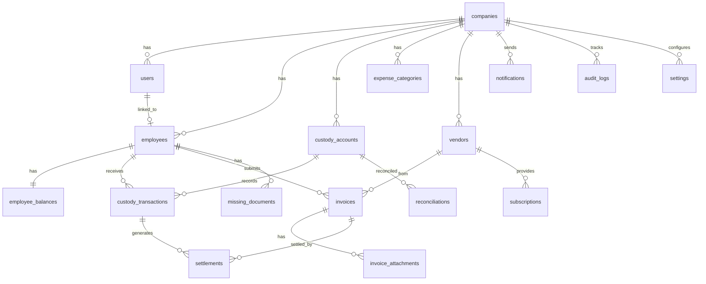

# APMS Database Schema & ERD

## Entity Relationship Diagram

## Core Tables (24)

| Table | Purpose |
|-------|---------|
| `companies` | Multi-tenant company records |
| `users` | Auth users with RBAC roles |
| `employees` | Employee profiles |
| `custody_accounts` | Main custody holder accounts |
| `employee_balances` | Computed balance cache |
| `custody_transactions` | All custody movements |
| `invoices` | Invoice records with VAT |
| `invoice_attachments` | File attachments (OCR-ready) |
| `missing_documents` | Missing invoice workflow |
| `card_transactions` | Corporate card expenses |
| `subscriptions` | Recurring subscription tracking |
| `settlements` | Invoice settlement records |
| `reconciliations` | Month-end reconciliation |
| `vendors` | Vendor master data |
| `expense_categories` | Expense categorization |
| `notifications` | Alert system |
| `documents` | Generic document metadata |
| `comments` | Entity comments |
| `tasks` | Action items |
| `reminders` | Scheduled reminders |
| `settings` | Company configuration |
| `audit_logs` | Full audit trail |
| `activity_logs` | User activity tracking |

## Key Constraints

- `employee_balances.outstanding_balance` — Generated column (transferred − settled − returned)
- `reconciliations.difference` — Generated column (actual − expected bank balance)
- `reconciliations` — Unique per company/account/month/year
- All financial tables have `company_id` for multi-tenancy
- RLS policies enforce company-scoped access

## Indexes

Optimized indexes on:
- Employee status, company lookups
- Transaction dates, invoice status
- Subscription renewal dates
- Notification read status
- Audit log entity lookups

## Migration

Run: `supabase/migrations/001_initial_schema.sql`
